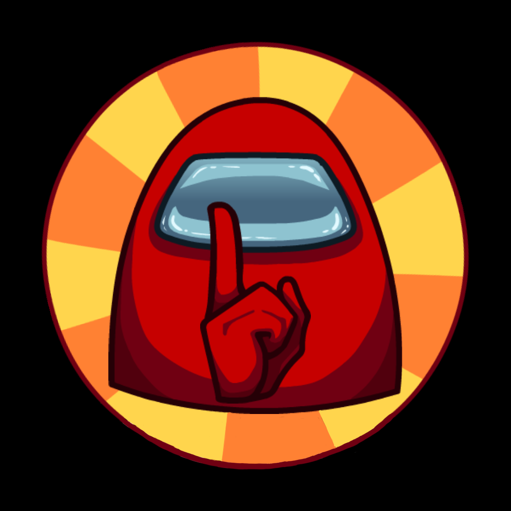

<p align="center">
  
  <h1 align="center">Shhh!</h1>
  <p align="center">A small Among Us Discord Bot that takes care of simultaneously muting/unmuting all Players</p>
</p>

<br/>

<p  align="center">
  <a href="https://discord.com/api/oauth2/authorize?client_id=745121735053017159&permissions=4194304&scope=bot"></a> 
</p>

<br/>

## Commands

```
!!start (code)
```

Starts a new Session. User must be in a voice channel and can optionally provide the game code.

<br/>

```
!!stop
```

Stops a running Session. User must be in a voice channel.

<br/>

```
!!mute
```

Manually mute all members in the voice channel.

<br/>

```
!!unmute
```

Manually unmute all members in the voice channel.

<br/>

```
!!help (name)
```

Print help message. General or for specific commands.
